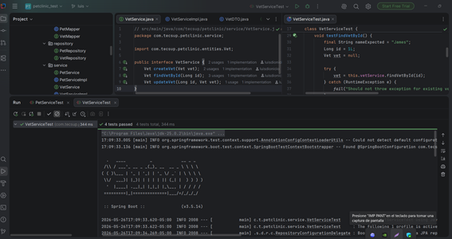

###### Grupo 2 — Integrante A
Se implementaron pruebas unitarias para el módulo VetService usando Spring Boot, JUnit 5 y base de datos H2 en memoria.
Pruebas realizadas:
testCreateVet → crear veterinario.
testUpdateVet → actualizar datos.
testFindVetById → buscar veterinario existente.
#### Tecnologías usadas
Spring Boot
JUnit 5
H2 Database
Spring Data JPA
Maven
##### Archivos trabajados
VetServiceImpl.java
VetServiceTest.java
VetRepository.java
Vet.java
###### Resultado final:
Las pruebas CRUD funcionaron correctamente validando la creación, actualización y búsqueda de veterinarios usando los datos cargados en H2.
Compila sin errores:

##### Integrante B

##### Integrante C