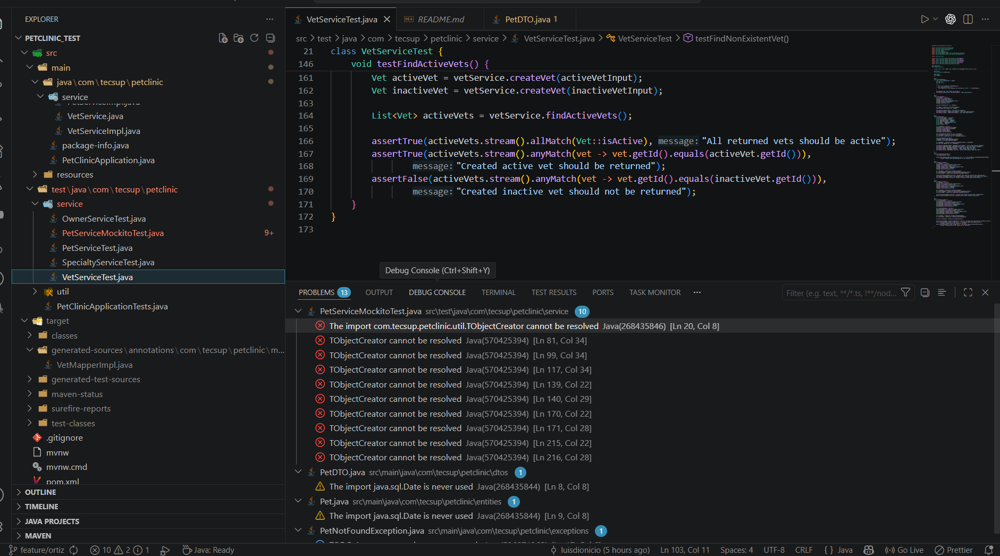
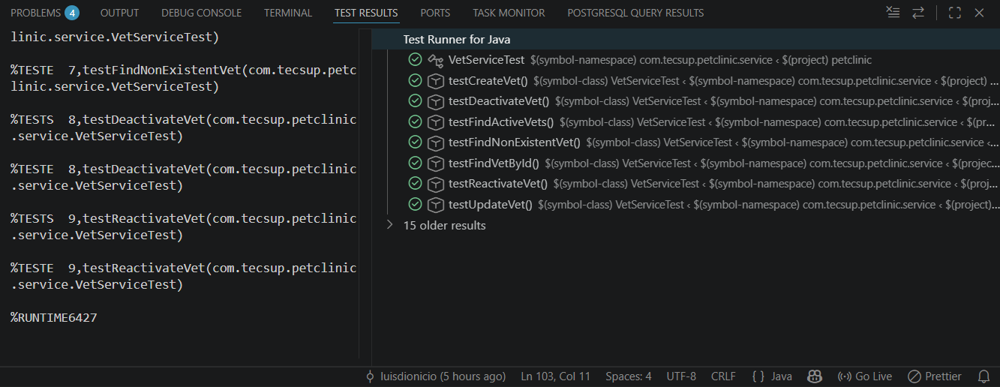
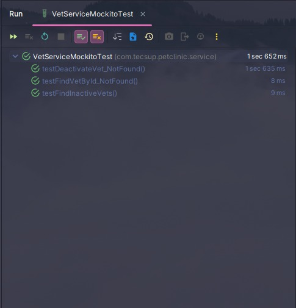

###### Grupo 2 — Integrante A - LUIS ANGEL DIONICIO BARTOLO
Se implementaron pruebas unitarias para el módulo VetService usando Spring Boot, JUnit 5 y base de datos H2 en memoria.
Pruebas realizadas:
testCreateVet → crear veterinario.
testUpdateVet → actualizar datos.
testFindVetById → buscar veterinario existente.
#### Tecnologías usadas
Spring Boot
JUnit 5
H2 Database
Spring Data JPA
Maven
##### Archivos trabajados
VetServiceImpl.java
VetServiceTest.java
VetRepository.java
Vet.java
###### Resultado final:
Las pruebas CRUD funcionaron correctamente validando la creación, actualización y búsqueda de veterinarios usando los datos cargados en H2.
Compila sin errores:

### Integrante B - Jeronimo Rodrigo Ortiz Ortiz

- Se trabajó el bloque asignado de `VetService` para validar `testDeactivateVet`, `testReactivateVet` y `testFindActiveVets` con asistencia IA local de Tecsup. 

- La funcionalidad implementa soft delete mediante el campo `active`, permitiendo desactivar y reactivar veterinarios sin eliminar registros físicamente.  

- También se agregó la consulta de veterinarios activos usando Spring Data JPA.  

- Los archivos principales revisados fueron `VetService`, `VetServiceImpl`, `VetRepository`, `Vet` y `VetServiceTest`. 

- Durante el proceso se corrigieron problemas de integración con la rama base y falsos errores del IDE sobre código generado por MapStruct.

- La validación final se realizó con Maven, obteniendo `BUILD SUCCESS`.

#### 1. Error crítico por sobrecodigo generado durante un merge.

#### 2. Valicaciones correctas

##### Integrante C

👨‍💻 Integrante C — Rony Quintana
⚙️ Filtros y Manejo de Errores

🔹 Descripción general
Se implementaron pruebas unitarias enfocadas en validar el correcto filtrado de datos y el manejo de excepciones dentro del servicio de tipos de mascotas (TypeService).

🔹 Pruebas realizadas

✅ testGetPetCountByType_ExcludeInactive
→ Verifica que el sistema excluya registros con active = false, asegurando reportes con datos válidos.

❌ testFindTypeById_NotFound
→ Valida que se lance la excepción TypeNotFoundException cuando no existe el tipo de mascota.

❌ testDeleteType_NotFound
→ Comprueba que el sistema lance una excepción al intentar eliminar un registro inexistente.

🔹 Archivos trabajados
📁 TypeServiceImpl.java
📁 TypeServiceTest.java
📁 TypeRepository.java
📁 Type.java

📸 Evidencia de ejecución

🖼️ Resultado de las pruebas ejecutadas correctamente:

