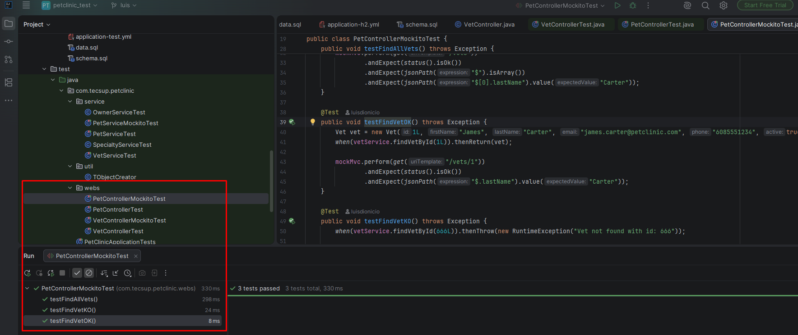
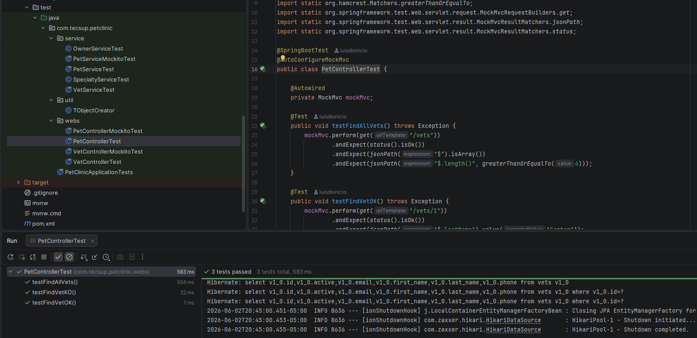
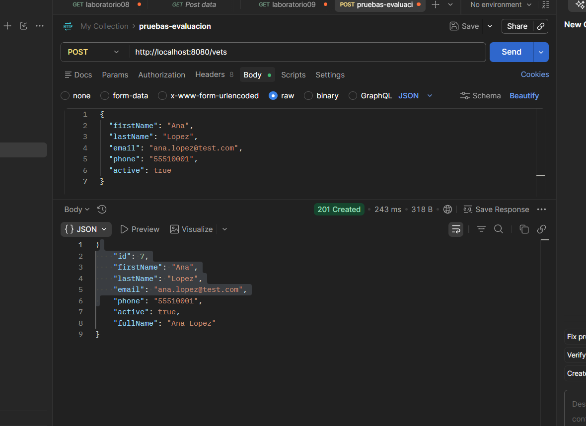
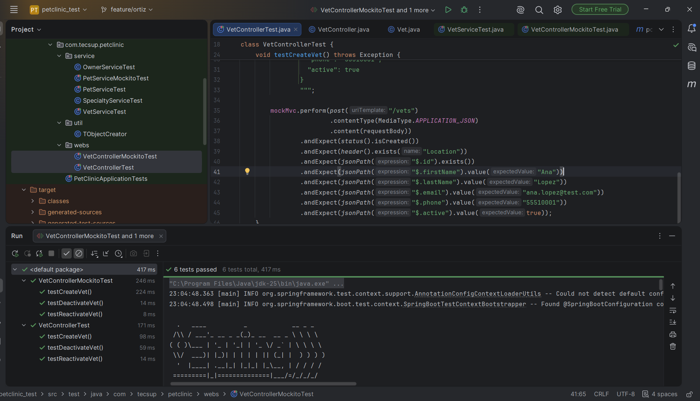
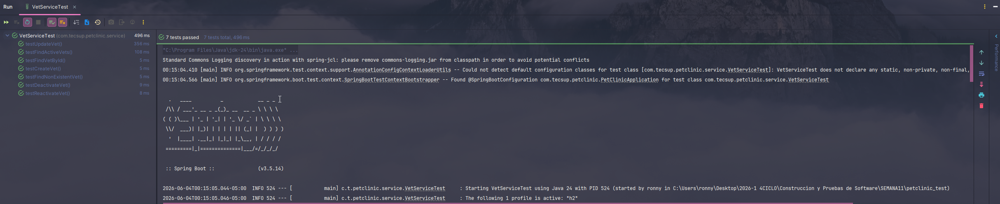
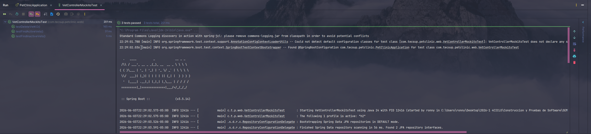
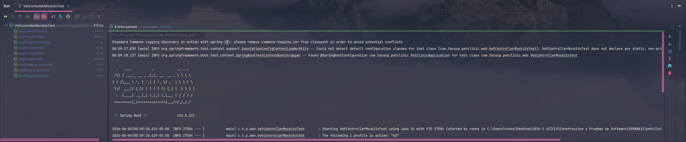
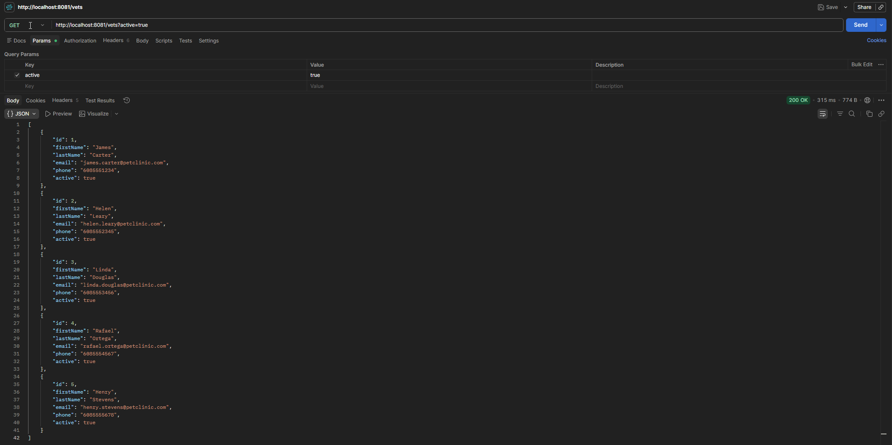
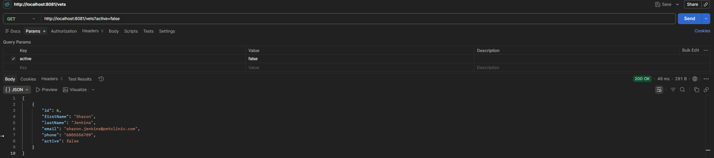

# PetClinic — Examen de Pruebas de Integración (Capa Web)

**Duración:** 2.5 horas | **Stack:** Spring Boot + JUnit 5 + Spring Test (`@SpringBootTest` + MockMvc) + Mockito + H2

---

## 📌 Reglas generales

- Repositorio en GitHub o GitLab. Rama `main` protegida.
- Cada integrante trabaja en su propia rama `feature/...`.
- Toda integración a `main` se hace por merge con al menos 1 revisor del equipo.
- Cada integrante debe tener commits propios con su nombre/correo real.
- Mínimo: una rama por integrante, un merge fusionado por integrante y 1 conflicto resuelto.
- Al final, ejecutar `./mvnw clean test -Dspring.profiles.active=h2` debe pasar sin errores.

---

## 🎯 Objetivo

Cada grupo debe escribir pruebas de la capa web (controladores REST) de su entidad asignada, siguiendo los dos patrones que ya trae el proyecto como plantilla:

### 1. `VetControllerTest` — Integración real (extremo a extremo)

`@SpringBootTest` + `@AutoConfigureMockMvc` + `MockMvc`. Sin mocks: la petición HTTP atraviesa el stack real (controlador → servicio → repositorio → H2). Se apoya en los datos iniciales precargados por `schema.sql` / `data.sql`.

### 2. `VetControllerMockitoTest` — Controlador aislado con servicio mockeado

`@SpringBootTest` + `@AutoConfigureMockMvc` + `MockMvc`, pero con `@MockitoBean` del servicio. Se usa `Mockito.when(...)` para definir la respuesta del servicio, de modo que solo se prueba la lógica del controlador y el contrato JSON, sin tocar la BD.

Cada integrante entrega ambos archivos para su bloque de endpoints: la versión de integración real y la versión con Mockito. Los mismos endpoints, probados de las dos formas.

---

## 🧩 Estructura de archivos (Grupo 2 — Vets)

```
src/test/java/com/tecsup/petclinic/
├── web/
│   ├── VetControllerTest.java
│   └── VetControllerMockitoTest.java
└── service/
    ├── VetServiceTest.java
    └── VetServiceMockitoTest.java
```

---

## 👥 Integrantes

---

### Integrante A — Luis Angel Dionicio Bartolo

Se implementaron pruebas para el módulo `VetService` y los endpoints de listado y consulta.

**Pruebas realizadas:**
- `testCreateVet` → crear veterinario.
- `testUpdateVet` → actualizar datos.
- `testFindVetById` → buscar veterinario existente.
- `testFindAllVets` → `GET /vets` → 200 OK y lista JSON.
- `testFindVetOK` → `GET /vets/1` → 200 OK, `$.lastName = "Carter"`.
- `testFindVetKO` → `GET /vets/666` → 404 Not Found.

**Tecnologías usadas:** Spring Boot · JUnit 5 · H2 Database · Spring Data JPA · Maven

**Archivos trabajados:** `VetServiceImpl.java` · `VetServiceTest.java` · `VetRepository.java` · `Vet.java`

**Resultado:** Las pruebas CRUD funcionaron correctamente validando la creación, actualización y búsqueda de veterinarios usando los datos cargados en H2.


#### 2da Prueba de Integración





---

### Integrante B — Jeronimo Rodrigo Ortiz Ortiz

Se trabajó el bloque asignado de `VetService` para validar `testDeactivateVet`, `testReactivateVet` y `testFindActiveVets` con asistencia IA local de Tecsup.

La funcionalidad implementa soft delete mediante el campo `active`, permitiendo desactivar y reactivar veterinarios sin eliminar registros físicamente. También se agregó la consulta de veterinarios activos usando Spring Data JPA.

Los archivos principales revisados fueron `VetService`, `VetServiceImpl`, `VetRepository`, `Vet` y `VetServiceTest`.

Durante el proceso se corrigieron problemas de integración con la rama base y falsos errores del IDE sobre código generado por MapStruct. La validación final se realizó con Maven, obteniendo `BUILD SUCCESS`.

#### 1. Error crítico por sobrecodigo generado durante un merge


#### 2. Validaciones correctas


#### 2da Parte — Pruebas de Integración: Creación y soft delete

Levantando la app con perfil H2:
```
.\mvnw.cmd spring-boot:run "-Dspring-boot.run.profiles=h2"
```

- `testCreateVet` — `POST /vets` → 201 Created, `active = true`.



- `testDeactivateVet` — `PUT /vets/{id}/deactivate` → 200 OK, `$.active = false`.


- `testReactivateVet` — `PUT /vets/{id}/reactivate` → 200 OK, `$.active = true` (vet id=6).


- Ejecución completa con perfil h2.



---

### Integrante C — Rony Quintana

⚙️ 1. Pruebas Unitarias — TypeService (Lógica de Negocio)
🔹 Descripción general

Se implementaron pruebas unitarias enfocadas en validar el correcto filtrado de datos y el manejo de excepciones dentro del servicio de tipos de mascotas (TypeService).

- Pruebas realizadas
- testGetPetCountByType_ExcludeInactive
- Verifica que el sistema excluya registros con active = false, asegurando reportes con datos válidos.
- testFindTypeById_NotFound
- Valida que se lance la excepción TypeNotFoundException cuando no existe el tipo de mascota.
- testDeleteType_NotFound
- Comprueba que el sistema lance una excepción al intentar eliminar un registro inexistente.
- Archivos trabajados

📂 TypeServiceImpl.java
📂 TypeServiceTest.java
📂 TypeRepository.java
📂 Type.java

**VetServiceTest**




🌐 2. Pruebas Web — VetController (Integración + Mockito)
🔹 Descripción general
Se implementaron las pruebas de filtros y borrado para la capa web del controlador de veterinarios.

**Pruebas realizadas:**
- `testFindActiveVets` → `GET /vets?active=true` → 200 OK, retorna solo veterinarios activos.
- `testFindInactiveVets` → `GET /vets?active=false` → 200 OK, retorna solo veterinarios inactivos.
- `testDeleteVetKO` → `DELETE /vets/1000` → 404 Not Found cuando el veterinario no existe.

**Archivos trabajados:** `VetController.java` · `VetService.java` · `VetServiceImpl.java` · `VetControllerMockitoTest.java` · `VetControllerTest.java`

**Resultado:** Los 9 tests de la capa web pasan correctamente en ambas modalidades (integración real y con Mockito).

#### Evidencia — Tests ejecutados correctamente


**VetControllerMockitoTest — 3 tests:*



**VetControllerTest — 9/9 tests:**



#### Evidencia — Postman

**GET /vets?active=true**



**GET /vets?active=false**



**DELETE /vets/1000 → 404**


